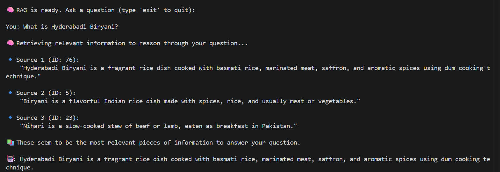
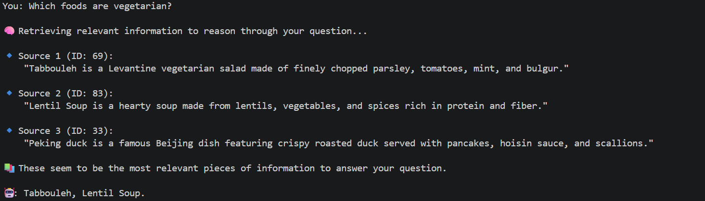
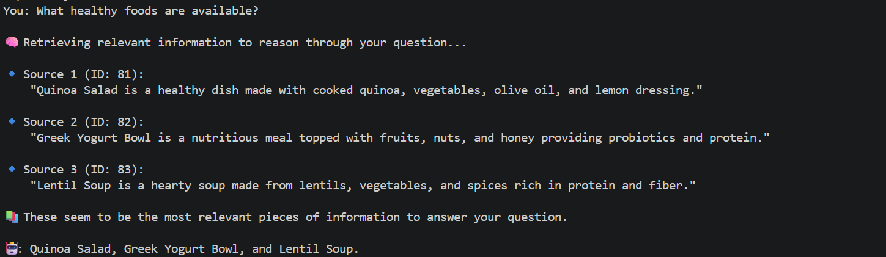
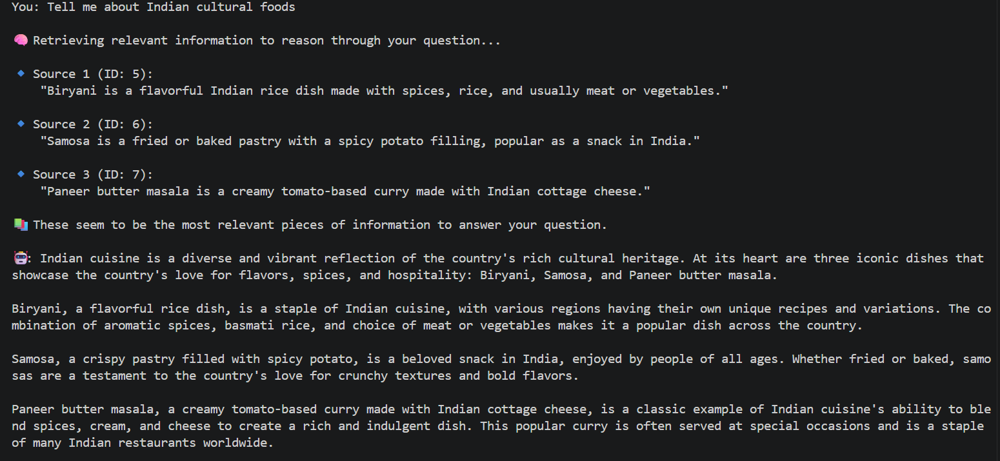
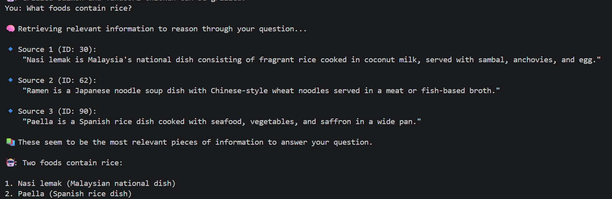
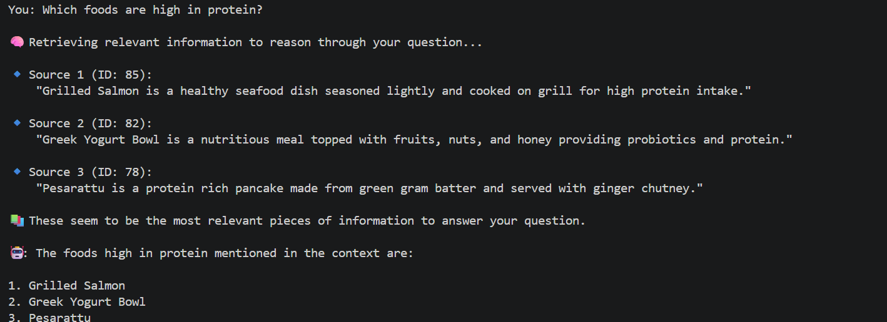
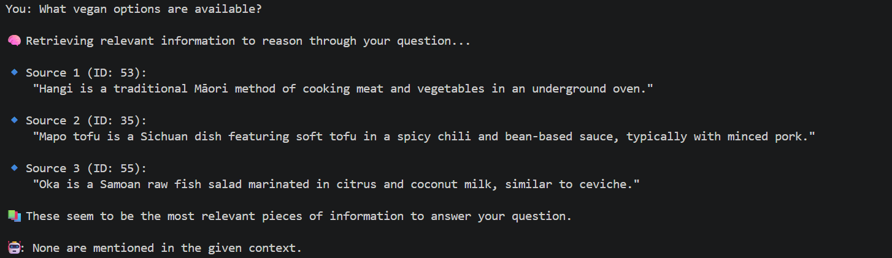
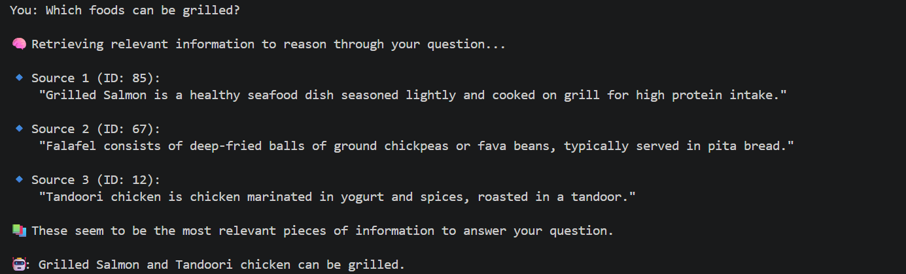

Here’s a clear, beginner-friendly `README.md` for your RAG project, designed to explain what it does, how it works, and how someone can run it from scratch.

---

## 📄 `README.md`

````markdown
# 🧠 RAG-Food: Simple Retrieval-Augmented Generation with ChromaDB + Ollama

This is a **minimal working RAG (Retrieval-Augmented Generation)** demo using:

- ✅ Local LLM via [Ollama](https://ollama.com/)
- ✅ Local embeddings via `mxbai-embed-large`
- ✅ [ChromaDB](https://www.trychroma.com/) as the vector database
- ✅ A simple food dataset in JSON (Indian foods, fruits, etc.)

---

## 🎯 What This Does

This app allows you to ask questions like:

- “Which Indian dish uses chickpeas?”
- “What dessert is made from milk and soaked in syrup?”
- “What is masala dosa made of?”

It **does not rely on the LLM’s built-in memory**. Instead, it:

1. **Embeds your custom text data** (about food) using `mxbai-embed-large`
2. Stores those embeddings in **ChromaDB**
3. For any question, it:
   - Embeds your question
   - Finds relevant context via similarity search
   - Passes that context + question to a local LLM (`llama3.2`)
4. Returns a natural-language answer grounded in your data.

---

## 📦 Requirements

### ✅ Software

- Python 3.8+
- Ollama installed and running locally
- ChromaDB installed

### ✅ Ollama Models Needed

Run these in your terminal to install them:

```bash
ollama pull llama3.2
ollama pull mxbai-embed-large
````

> Make sure `ollama` is running in the background. You can test it with:
>
> ```bash
> ollama run llama3.2
> ```

---

## 🛠️ Installation & Setup

### 1. Clone or download this repo

```bash
git clone https://github.com/yourname/rag-food
cd rag-food
```

### 2. Install Python dependencies

```bash
pip install chromadb requests
```

### 3. Run the RAG app

```bash
python rag_run.py
```

If it's the first time, it will:

* Create `foods.json` if missing
* Generate embeddings for all food items
* Load them into ChromaDB
* Run a few example questions

---

## 📁 File Structure

```
rag-food/
├── rag_run.py       # Main app script
├── foods.json       # Food knowledge base (created if missing)
├── README.md        # This file
```

---

## 🧠 How It Works (Step-by-Step)

1. **Data** is loaded from `foods.json`
2. Each entry is embedded using Ollama's `mxbai-embed-large`
3. Embeddings are stored in ChromaDB
4. When you ask a question:

   * The question is embedded
   * The top 1–2 most relevant chunks are retrieved
   * The context + question is passed to `llama3.2`
   * The model answers using that info only

---

## 🔍 Try Custom Questions

You can update `rag_run.py` to include your own questions like:

```python
print(rag_query("What is tandoori chicken?"))
print(rag_query("Which foods are spicy and vegetarian?"))
```

---

## 🚀 Next Ideas

* Swap in larger datasets (Wikipedia articles, recipes, PDFs)
* Add a web UI with Gradio or Flask
* Cache embeddings to avoid reprocessing on every run

---

## 👨‍🍳 Credits

Made by Callum using:

* [Ollama](https://ollama.com)
* [ChromaDB](https://www.trychroma.com)
* [mxbai-embed-large](https://ollama.com/library/mxbai-embed-large)
* Indian food inspiration 🍛

# Smart Food Assistant – RAG Project Customisation

## Student Name
**PRANAY GOUD YERRA**

---

# Project Customisation Overview

For this project, I improved a smart food assistant by adding 15 new dishes from different cultures along with several healthy options. The goal was to expand the system’s knowledge so it can better understand user questions and provide more relevant answers. Each food item I added includes:

- Description  
- Ingredients  
- Preparation method  
- Nutritional highlights  
- Cultural background  
- Dietary information (Vegetarian, Vegan, Gluten-free)


After updating the dataset, I tested the system with different types of questions. These included asking about specific dishes, searching for healthy foods, checking vegetarian options, and finding foods from particular regions.

The assistant successfully retrieved the most relevant information from the updated data and generated clear responses based on that content.

This project demonstrates how adding structured data improves response quality. With more detailed entries, the assistant provides more accurate and informative answers. The enhanced version now responds more effectively and gives better food recommendations using the expanded dataset.

---

# 15 New Food Items Added

## Cultural Foods
- Hyderabadi Biryani – Aromatic dum cooked rice with spices and meat  
- Dosa – Fermented rice and lentil crispy crepe  
- Pesarattu – Protein rich green gram pancake  
- Pulihora – Tamarind flavored tangy rice dish  
- Gongura Chicken – Spicy chicken cooked with sorrel leaves  

## Healthy Foods
- Quinoa Salad – High protein grain salad with vegetables  
- Greek Yogurt Bowl – Probiotic rich yogurt with fruits and nuts  
- Lentil Soup – High fiber and protein vegetable soup  
- Avocado Toast – Healthy fat rich breakfast dish  
- Grilled Salmon – Omega-3 rich grilled fish  

## International Foods
- Sushi – Japanese rice and seafood roll  
- Tacos – Mexican tortilla filled street food  
- Pad Thai – Thai stir fried rice noodles  
- Margherita Pizza – Classic Italian pizza  
- Paella – Spanish rice dish with seafood  

---

# Installation and Setup Instructions

## Step 1. Clone Repository
```bash
git clone https://github.com/pranmoksha-svg/ragfood.git
cd ragfood
```

## Step 2: Install Dependencies

Install all required Python libraries using the requirements file.

```bash
pip install -r requirements.txt
```

## Step 3: Install Ollama Models

Download the required Ollama models for embeddings and response generation.

```bash
ollama pull llama3
ollama pull nomic-embed-text
```
## Step 4: Run RAG System

Start the Smart Food Assistant application.

```bash
python rag_run.py
```

# Sample Queries and Expected Responses

## Query 1
**What is Hyderabadi Biryani?**  
```
Expected Output: Description of dum cooked rice dish with spices and meat.
```

## Query 2
**Which foods are vegetarian?**
```
Expected Output:
- Dosa  
- Pulihora  
- Quinoa Salad  
- Avocado Toast  
- Margherita Pizza  
```
## Query 3
**What healthy foods are available?**
```
Expected Output:
- Quinoa Salad  
- Greek Yogurt Bowl  
- Lentil Soup  
- Grilled Salmon  
```
## Query 4
**Tell me about Indian cultural foods**
```
Expected:
- Biryani  
- Samosa  
- Paneer Butter Masala  
```
## Query 5
**What foods contain rice?**
```
Expected Output:
- Hyderabadi Biryani  
- Sushi  
- Paella  
- Pulihora  
```
## Query 6
Which foods are high in protein?
```
Expected:
- Grilled Salmon  
- Greek Yogurt Bowl  
- Pesarattu  
```
## Query 7
What vegan options are available?
```
Expected:
🧠 Retrieving relevant information to reason through your question...

🔹 Source 1 (ID: 53):  
"Hangi is a traditional Māori method of cooking meat and vegetables in an underground oven."

🔹 Source 2 (ID: 35):  
"Mapo tofu is a Sichuan dish featuring soft tofu in a spicy chili and bean-based sauce, typically with minced pork."

🔹 Source 3 (ID: 55):  
"Oka is a Samoan raw fish salad marinated in citrus and coconut milk, similar to ceviche."

📚 These seem to be the most relevant pieces of information to answer your question.

🤖 None are mentioned in the given context.
```
## Query 8
Which foods can be grilled?
```
🧠 Retrieving relevant information to reason through your question...

🔹 Source 1 (ID: 85):  
"Grilled Salmon is a healthy seafood dish seasoned lightly and cooked on grill for high protein intake."

🔹 Source 2 (ID: 67):  
"Falafel consists of deep-fried balls of ground chickpeas or fava beans, typically served in pita bread."

🔹 Source 3 (ID: 12):  
"Tandoori chicken is chicken marinated in yogurt and spices, roasted in a tandoor."

📚 These seem to be the most relevant pieces of information to answer your question.

🤖 Grilled Salmon and Tandoori chicken can be grilled.
```
# Screenshots

## Query 1

## Query 2

## Query 3

## Query 4

## Query 5

## Query 6

## Query 7

## Query 8


# RAG Learning Reflection

For this project, I worked on improving a smart food assistant that can search and explain food-related information more effectively. My main task was to expand the dataset by adding 15 new meals from different cultures, along with several healthy food options. This helped the system understand a wider variety of user queries. By expanding the dataset, I improved how the system retrieves relevant information. Instead of depending only on exact keyword matches, the assistant can now identify results based on semantic meaning. This makes the responses more accurate and useful for users asking different types of questions. Through this process, I learned how structured data directly affects the quality of answers. Organising each food item with detailed fields such as ingredients, nutritional value, preparation method, and dietary classification helped the system return more precise and meaningful results. I also tested the assistant using different types of queries, including dietary restrictions, cultural cuisines, and healthy meal options. These tests confirmed that the retrieval process was working correctly and that the improvements were effective. Additionally, I practiced version control by forking the repository, making updates, committing changes, and pushing them to my own GitHub repository. This helped me better understand how to maintain a clean and traceable project history while working on a real project. Overall, this project gave me hands-on experience in improving a data-driven information retrieval system, testing and validating functional improvements, and documenting results in a structured and professional way.